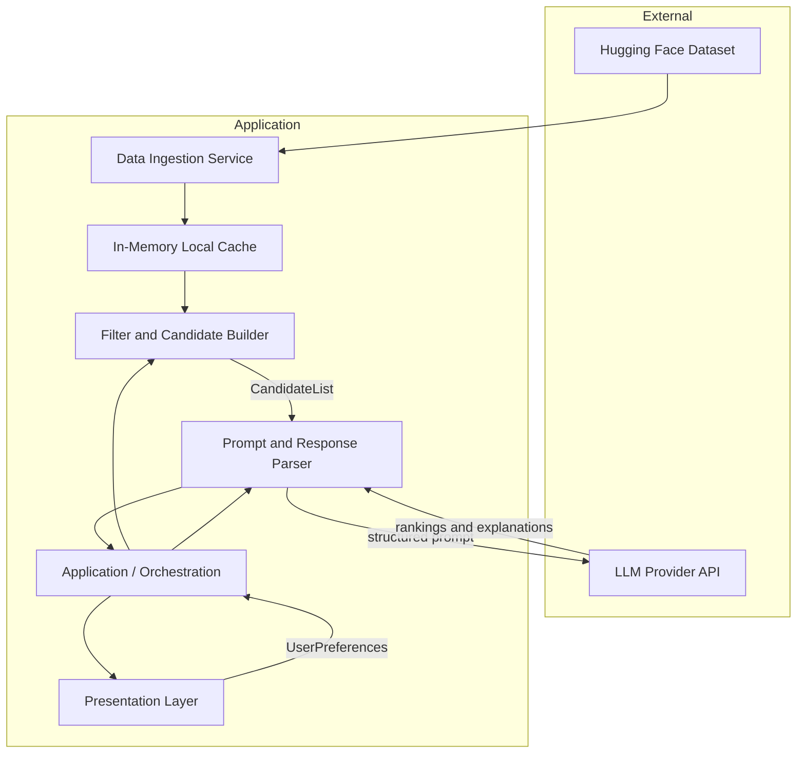
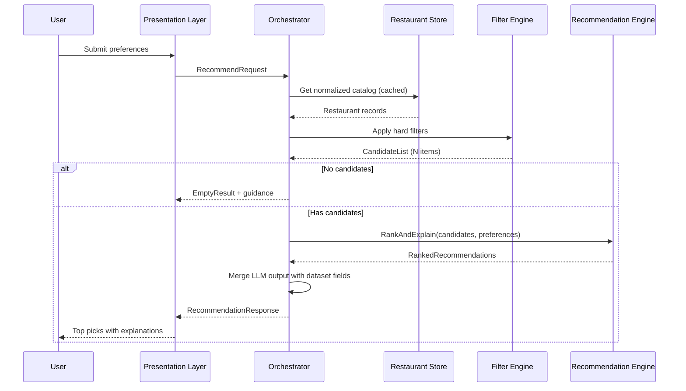
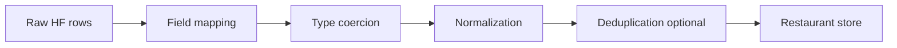
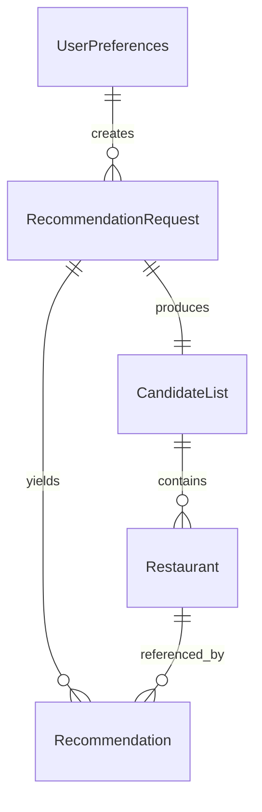
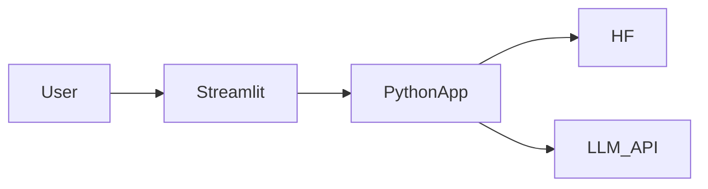
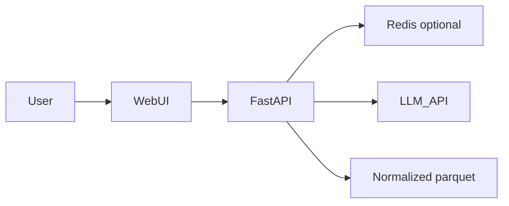

# Architecture: AI-Powered Restaurant Recommendation System

This document defines the technical architecture for the Zomato-inspired restaurant recommendation service described in [context.md](./context.md). It translates product requirements into layers, components, data contracts, and runtime behavior.

---

## 1. Architectural Goals

| Goal | How the architecture supports it |
|------|-----------------------------------|
| **Accuracy** | Structured filtering on real dataset fields before any LLM call |
| **Personalization** | LLM ranks and explains matches using user preferences + candidate context |
| **Transparency** | Every result includes dataset facts plus an AI-generated rationale |
| **Maintainability** | Clear separation: data ingestion, filtering, prompting, presentation |
| **Cost & latency control** | Send only a bounded candidate set to the LLM, not the full catalog |

### Core principle: hybrid retrieval

The system is **not** a pure “ask the LLM for restaurant names” design. The LLM never invents restaurants; it reasons over **pre-filtered, structured records** from the Hugging Face dataset.

```
Deterministic filter (dataset)  →  Bounded candidates  →  LLM (rank + explain)  →  UI
```

---

## 2. High-Level System View

### 2.1 Logical architecture



### 2.2 Request lifecycle (single recommendation flow)



---

## 3. Layered Architecture

### 3.1 Layer overview

| Layer | Responsibility | Key outputs |
|-------|----------------|-------------|
| **Presentation** | Collect preferences; render results | Forms, result cards, empty/error states |
| **Application / Orchestration** | End-to-end flow, validation, merging | `RecommendationResponse` |
| **Integration** | Filter, serialize candidates, build prompts, parse LLM JSON | `CandidateList`, `PromptPayload` |
| **Recommendation (LLM)** | Rank, explain, optional summary | `LLMRankingResult` |
| **Data** | Load, normalize, cache dataset | `Restaurant` records |

### 3.2 Presentation layer

**Purpose:** Zomato-style discovery UX—user states what they want; system returns a short, scannable list.

**Components:**

| Component | Description |
|-----------|-------------|
| **Preference form** | Inputs for location, budget tier, cuisine, minimum rating, free-text extras |
| **Results view** | Cards/table: name, cuisine, rating, cost, AI explanation |
| **Summary block** (optional) | LLM-generated overview of the shortlist |
| **Feedback states** | Loading, no matches, LLM failure with fallback messaging |

**Suggested UI structure:**

```
┌─────────────────────────────────────────────────────────┐
│  Find restaurants                                        │
│  [Location ▼] [Budget ▼] [Cuisine ▼] [Min rating ▼]     │
│  [Additional preferences: _______________________]     │
│                              [ Get recommendations ]     │
├─────────────────────────────────────────────────────────┤
│  Summary (optional): "Here are 3 strong matches in..."   │
├─────────────────────────────────────────────────────────┤
│  ┌─────────────────────────────────────────────────┐    │
│  │ Restaurant A  ★ 4.5  · Italian  · ₹₹           │    │
│  │ Why: Matches your budget and high rating...      │    │
│  └─────────────────────────────────────────────────┘    │
│  ... more cards ...                                      │
└─────────────────────────────────────────────────────────┘
```

**Validation rules (client or server):**

- Location: required (or default city if product allows)
- Budget: enum `low | medium | high`
- Cuisine: optional but recommended; empty = no cuisine filter
- Minimum rating: numeric, clamped to dataset scale (e.g. 0–5)
- Additional preferences: optional string, max length capped for prompt safety

---

### 3.3 Application / orchestration layer

**Purpose:** Single entry point for “get recommendations”; coordinates filter → LLM → merge.

**Primary operation:**

```
recommend(preferences: UserPreferences) → RecommendationResponse
```

**Orchestration steps:**

1. Validate and normalize `UserPreferences`
2. Load restaurant catalog from data layer (cache hit preferred)
3. Run deterministic filters → `CandidateList`
4. If `candidates.length === 0`, return empty response with user guidance (relax filters)
5. Cap candidates (e.g. top 15–25 by rating/cost heuristic) before LLM
6. Call recommendation engine with candidates + preferences
7. Parse LLM response; join each rank entry with full `Restaurant` by stable ID
8. Return top *K* (e.g. 3–5) with merged fields + explanations

**Idempotency:** Same preferences + same dataset snapshot → reproducible filter results; LLM output may vary unless temperature is 0.

---

### 3.4 Data layer (ingestion & store)

**Purpose:** Load Hugging Face dataset once (or on schedule), normalize into internal schema, serve fast reads.

**Data source:**

- Dataset: [ManikaSaini/zomato-restaurant-recommendation](https://huggingface.co/datasets/ManikaSaini/zomato-restaurant-recommendation)
- Loader: `datasets` library (Python) or equivalent HF client

**Ingestion pipeline:**



**Normalization responsibilities:**

| Raw concern | Normalized behavior |
|-------------|---------------------|
| Location strings | Canonical city/area labels; trim, case-fold for matching |
| Cuisine | Split multi-value strings; primary + tags list |
| Cost | Map to `BudgetTier` (low/medium/high) using thresholds or dataset field |
| Rating | Float; handle missing as exclude or default per policy |
| Name | Trim; use as display + join key with generated `id` |

**Storage options (implementation choice):**

| Option | When to use |
|--------|-------------|
| In-memory list after startup load | MVP, single process, demo |
| Parquet/CSV on disk + memory index | Faster restarts, larger data |
| Embedded DB (SQLite) | Query by location/cuisine without full scan |

**Caching:**

- Cache full normalized catalog after first load
- Optional: cache last LLM response keyed by hash(preferences + candidate IDs)—use sparingly due to staleness

---

### 3.5 Integration layer (filter + prompt)

This layer sits between data and LLM. It implements the **Integration Layer** from [context.md](./context.md).

#### 3.5.1 Filter engine

**Purpose:** Reduce the catalog to relevant candidates using **hard constraints** only.

**Filter pipeline (ordered):**

```
location match → cuisine match → min rating → budget tier → (optional) keyword scan on extras
```

| Filter | Logic |
|--------|--------|
| **Location** | Restaurant location/city contains or equals user location (normalized) |
| **Cuisine** | User cuisine in restaurant cuisine list (case-insensitive) |
| **Minimum rating** | `restaurant.rating >= preferences.minRating` |
| **Budget** | `restaurant.budgetTier === preferences.budget` or cost within tier band |
| **Additional preferences** | Soft signal: keyword match on name/cuisine/tags OR defer entirely to LLM |

**Candidate cap:** After filters, sort by rating (desc) and take top `MAX_CANDIDATES` (recommended: 15–25) to control token usage.

**Output contract:**

```typescript
// Illustrative; adapt to Python/TS/etc.
interface CandidateList {
  candidates: Restaurant[];
  appliedFilters: string[];
  totalBeforeFilter: number;
  totalAfterFilter: number;
}
```

#### 3.5.2 Prompt builder

**Purpose:** Assemble a structured prompt so the LLM can rank and justify without hallucinating new venues.

**Prompt structure:**

| Section | Content |
|---------|---------|
| **System** | Role: restaurant advisor; rules: only use provided list; output JSON schema |
| **User context** | Serialized `UserPreferences` |
| **Candidate table** | Compact JSON/array: id, name, location, cuisine, rating, cost, budgetTier |
| **Task** | Rank top N; explain each; optional 1–2 sentence summary |
| **Output format** | Strict JSON schema (see §5) |

#### 3.5.3 Response parser

**Purpose:** Validate LLM output, map `restaurantId` → `Restaurant`, handle malformed responses.

**Fallback strategy:**

1. Retry once with “fix JSON only” message
2. If still invalid: return filter-ordered top K with template explanation (“High rating match for your cuisine and budget.”)
3. Log parse errors for debugging

---

### 3.6 Recommendation engine (LLM)

**Purpose:** Semantic ranking and natural-language explanations over a **closed set** of candidates.

**Responsibilities:**

| Task | Owner |
|------|--------|
| Rank by fit (including soft prefs like “family-friendly”) | LLM |
| Per-restaurant explanation | LLM |
| Optional shortlist summary | LLM |
| Factual name, rating, cost | Dataset (never LLM-generated) |

**Non-responsibilities:**

- Discovering restaurants not in `CandidateList`
- Inventing ratings or prices

**Provider abstraction:**

```
interface LLMClient {
  complete(messages: Message[], options?: { temperature?: number }): Promise<string>;
}
```

Implementations: groq, Anthropic, Azure OpenAI, local Ollama, etc. Swappable via config.

**Recommended inference settings:**

- Temperature: `0.2–0.4` (balance consistency vs. phrasing variety)
- Max tokens: sized for N explanations (~800–1500 for top 5)
- Response format: JSON mode if provider supports it

---

## 4. Domain Model

### 4.1 Core entities



### 4.2 Schema definitions

#### `Restaurant` (normalized catalog record)

| Field | Type | Description |
|-------|------|-------------|
| `id` | string | Stable unique ID (generated or from dataset) |
| `name` | string | Restaurant name |
| `location` | string | City/area for display and filter |
| `cuisine` | string[] | One or more cuisines |
| `rating` | number | Aggregate rating |
| `estimatedCost` | string \| number | Display cost (e.g. "₹500 for two") |
| `budgetTier` | `low \| medium \| high` | Derived for budget filter |
| `raw` | object (optional) | Original row for debugging |

#### `UserPreferences`

| Field | Type | Required |
|-------|------|----------|
| `location` | string | Yes |
| `budget` | `low \| medium \| high` | Yes |
| `cuisine` | string | No |
| `minRating` | number | No (default: 0) |
| `additionalPreferences` | string | No |

#### `Recommendation` (API/UI payload)

| Field | Source |
|-------|--------|
| `restaurantId` | Dataset |
| `name` | Dataset |
| `cuisine` | Dataset |
| `rating` | Dataset |
| `estimatedCost` | Dataset |
| `rank` | LLM |
| `explanation` | LLM |
| `summary` | LLM (optional, once per response) |

---

## 5. LLM Contract (Prompt & Response)

### 5.1 Expected JSON response

```json
{
  "summary": "Three Italian spots in Bangalore that fit a medium budget and 4+ stars.",
  "recommendations": [
    {
      "restaurantId": "abc123",
      "rank": 1,
      "explanation": "Strong 4.6 rating, Italian cuisine, and mid-range pricing align with your preferences."
    }
  ]
}
```

**Validation rules:**

- Every `restaurantId` must exist in `CandidateList`
- `recommendations.length` ≤ requested top K
- No duplicate ranks or IDs
- Reject unknown IDs; optionally drop invalid entries and backfill from filter order

### 5.2 Prompt template (conceptual)

```
System: You are a restaurant recommendation assistant. You may ONLY recommend
restaurants from the CANDIDATES list. Return valid JSON matching the schema.

User preferences:
{preferences_json}

Candidates:
{candidates_json}

Tasks:
1. Rank the top {K} restaurants for these preferences.
2. For each, write a concise explanation (1-3 sentences) referencing specific attributes.
3. Optionally provide a brief summary of the overall shortlist.

Return JSON only.
```

---

## 6. Component Map (Suggested Modules)

For a typical Python + Streamlit/Gradio or FastAPI + React stack:

| Module | Path (example) | Role |
|--------|----------------|------|
| `config` | `app/config.py` | API keys, MAX_CANDIDATES, TOP_K |
| `models` | `app/models.py` | Pydantic/dataclasses for schemas above |
| `ingestion` | `app/data/loader.py` | HF download + normalize |
| `store` | `app/data/store.py` | Cached catalog access |
| `filters` | `app/integration/filters.py` | Deterministic filtering |
| `prompts` | `app/integration/prompts.py` | Template + fill |
| `parser` | `app/integration/parser.py` | JSON extract + validate |
| `llm` | `app/llm/client.py` | Provider adapter |
| `recommender` | `app/services/recommender.py` | Orchestration |
| `api` | `app/api/routes.py` | REST endpoint (optional) |
| `ui` | `app/ui/` or `frontend/` | Forms + results |

Monolith is sufficient for MVP; split into services only if scale demands it.

---

## 7. API Design (Optional Backend)

If the UI is separate from the core logic, expose a thin REST API:

### `POST /api/v1/recommendations`

**Request body:**

```json
{
  "location": "Bangalore",
  "budget": "medium",
  "cuisine": "Italian",
  "minRating": 4.0,
  "additionalPreferences": "family-friendly, quick service"
}
```

**Response:**

```json
{
  "summary": "...",
  "recommendations": [
    {
      "restaurantId": "abc123",
      "name": "Example Bistro",
      "cuisine": ["Italian"],
      "rating": 4.5,
      "estimatedCost": "₹800 for two",
      "rank": 1,
      "explanation": "..."
    }
  ],
  "meta": {
    "candidatesConsidered": 18,
    "filtersApplied": ["location", "cuisine", "minRating", "budget"]
  }
}
```

**Error codes:**

| Code | Meaning |
|------|---------|
| 400 | Invalid preferences |
| 404 | No restaurants match filters |
| 502 | LLM provider failure (include fallback flag if partial) |
| 503 | Dataset not loaded |

---

## 8. Data Flow Summary

```
┌──────────────┐     ┌──────────────┐     ┌──────────────┐
│ Hugging Face │────▶│  Ingestion   │────▶│    Store     │
└──────────────┘     └──────────────┘     └──────┬───────┘
                                                   │
┌──────────────┐     ┌──────────────┐              │
│     User     │────▶│ Preferences  │              │
└──────────────┘     └──────┬───────┘              │
                            │                      │
                            ▼                      ▼
                     ┌──────────────┐     ┌──────────────┐
                     │    Filter    │◀────│  All rows    │
                     └──────┬───────┘     └──────────────┘
                            │
                            ▼
                     ┌──────────────┐     ┌──────────────┐
                     │    Prompt    │────▶│     LLM      │
                     └──────┬───────┘     └──────┬───────┘
                            │                    │
                            ▼                    │
                     ┌──────────────┐◀───────────┘
                     │    Merge     │
                     └──────┬───────┘
                            ▼
                     ┌──────────────┐
                     │     UI       │
                     └──────────────┘
```

---

## 9. Cross-Cutting Concerns

### 9.1 Configuration

| Variable | Purpose | Example |
|----------|---------|---------|
| `HF_DATASET_ID` | Dataset identifier | `ManikaSaini/zomato-restaurant-recommendation` |
| `LLM_API_KEY` | Provider auth | env secret |
| `LLM_MODEL` | Model name / groq endpoint | `groq-recommendation-model` |
| `MAX_CANDIDATES` | Pre-LLM cap | `20` |
| `TOP_K` | Results shown | `5` |
| `BUDGET_THRESHOLDS` | Cost → tier mapping | config JSON |

### 9.2 Observability

- Log: preference hash, candidate count, LLM latency, token usage, parse success/failure
- Metrics (if deployed): request rate, empty-filter rate, LLM error rate

### 9.3 Security & privacy

- No PII required for MVP; preferences are session-scoped
- API keys only in server-side env, never in client bundles
- Sanitize `additionalPreferences` length; strip prompt-injection patterns if exposing public API

### 9.4 Performance

| Stage | Target (MVP) |
|-------|----------------|
| Catalog load | Once at startup; < few seconds |
| Filter | O(n) scan acceptable for demo dataset size |
| LLM call | Dominant latency; async UI spinner |

### 9.5 Reliability

| Failure | Behavior |
|---------|----------|
| Dataset load fails | Block app; show admin error |
| Zero filter matches | User message: broaden location/cuisine/rating |
| LLM timeout/error | Fallback: top K by rating with template explanations |
| Partial JSON | Drop invalid entries; backfill from filter ranking |

---

## 10. Deployment Views

### 10.1 MVP (single process)



- One container or local `streamlit run`
- Catalog in memory
- Suitable for demos and coursework

### 10.2 Production-lite (optional)



- Separate frontend and API
- Secrets via env / vault
- Rate limit on `/recommendations`

---

## 11. Testing Strategy

| Layer | Test type | Example |
|-------|-----------|---------|
| Ingestion | Unit | Field mapping, budget tier derivation |
| Filters | Unit | Location + rating edge cases |
| Prompts | Snapshot | Prompt contains all candidate IDs |
| Parser | Unit | Valid/invalid JSON, unknown IDs |
| Orchestrator | Integration | Mock LLM → merged response |
| E2E | Manual / automated | Submit form → 3 cards with explanations |

---

## 12. Alignment with Success Criteria

From [context.md](./context.md):

| Criterion | Architectural hook |
|-----------|-------------------|
| Dataset loads from Hugging Face | Data layer §3.4, ingestion pipeline |
| User specifies all preference types | Presentation §3.2, `UserPreferences` §4.2 |
| Filtering before LLM | Filter engine §3.5.1, hybrid principle §1 |
| LLM ranks and explains | Recommendation engine §3.6, contract §5 |
| Clear UI output | `Recommendation` schema §4.2, presentation §3.2 |

---

## 13. Future Extensions (Out of Current Scope)

Documented for evolution without breaking the core hybrid design:

- User accounts and saved preferences
- Geospatial radius instead of city string match
- Vector search for “vibe” queries before LLM
- A/B testing prompt variants
- Feedback loop (thumbs up/down) to tune ranking prompts
- Multi-language explanations

---

## 14. Document Map

| Document | Role |
|----------|------|
| [problemstatement.txt](./problemstatement.txt) | Original requirements |
| [context.md](./context.md) | Product context and workflow |
| **architecture.md** (this file) | Technical structure, components, contracts, and flows |

---

*This architecture is derived from [context.md](./context.md) and is implementation-agnostic where the problem statement does not mandate specific technologies. Choose stack (Python/Streamlit, FastAPI/React, etc.) at implementation time while preserving the layers and contracts above.*
