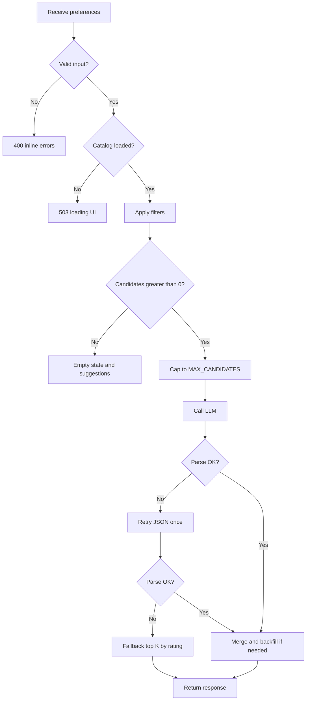

# Edge Cases & Handling Guide

This document catalogs edge cases for the **AI-Powered Restaurant Recommendation System**, with expected behavior for each. It complements [context.md](./context.md), [architecture.md](./architecture.md), and [implementation-plan.md](./implementation-plan.md).

**How to use this doc**

- **Implementers:** Apply the listed handling in the referenced module.
- **Testers:** Use the **Test ID** column for traceability in test plans.
- **Priority:** `P0` = must handle for MVP; `P1` = should handle; `P2` = nice-to-have / document only.

**Legend**

| Symbol | Meaning |
|--------|---------|
| **Detect** | How the system recognizes the case |
| **Handle** | Required system behavior |
| **User sees** | UI or API message (if applicable) |
| **Fallback** | Degraded path when primary path fails |

---

## Quick Reference by Layer

| Layer | Section | Example IDs |
|-------|---------|-------------|
| Data ingestion | §1 | DATA-01 … DATA-20 |
| User input | §2 | INPUT-01 … INPUT-18 |
| Filtering | §3 | FILT-01 … FILT-16 |
| LLM & prompt | §4 | LLM-01 … LLM-22 |
| Orchestration & merge | §5 | ORCH-01 … ORCH-12 |
| Presentation (UI) | §6 | UI-01 … UI-10 |
| External services | §7 | EXT-01 … EXT-10 |
| Security & abuse | §8 | SEC-01 … SEC-08 |
| Performance & ops | §9 | PERF-01 … PERF-08 |

---

## §1 Data Ingestion & Catalog

| ID | Scenario | Priority | Detect | Handle | User sees | Fallback |
|----|----------|----------|--------|--------|-----------|----------|
| **DATA-01** | Hugging Face unreachable (network, 503) | P0 | Load exception on startup | Fail startup; log error with dataset URL | “Unable to load restaurant data. Try again later.” | None; block app |
| **DATA-02** | Dataset ID wrong or removed from HF | P0 | `DatasetNotFound` or empty split | Fail startup; log configured `HF_DATASET_ID` | Admin/setup error message | None |
| **DATA-03** | Empty dataset (0 rows after load) | P0 | `len(catalog) == 0` | Fail startup | “No restaurant data available.” | None |
| **DATA-04** | Unexpected column names / schema drift | P0 | Missing required fields in mapper | Log raw schema; map known fields; skip unmappable rows with count | N/A (startup) | If &gt;50% rows fail mapping, fail startup |
| **DATA-05** | Missing `rating` on row | P0 | Null/NaN/empty rating | **Policy (choose one):** exclude row OR assign default (e.g. 0) and document | N/A | Exclude preferred for filter accuracy |
| **DATA-06** | Missing `name` or blank name | P0 | Empty after trim | Skip row; increment skip counter | N/A | — |
| **DATA-07** | Missing `location` | P1 | Empty location | Skip row OR assign `"Unknown"` (exclude from location filter) | N/A | Skip preferred |
| **DATA-08** | Missing cost / unparseable cost | P1 | Parse failure | Default `budgetTier` to `medium` OR exclude; log count | N/A | Default + flag in logs |
| **DATA-09** | Rating out of expected range (e.g. &gt;5 or negative) | P1 | Value &lt; 0 or &gt; 5 | Clamp to [0, 5] or exclude row | N/A | Clamp if source uses 0–5 scale |
| **DATA-10** | Duplicate restaurants (same name + location) | P2 | Hash collision on `id` | Deduplicate: keep highest rating; log duplicates | N/A | — |
| **DATA-11** | Cuisine as comma/pipe-separated string | P0 | Raw string contains delimiters | Split, trim, lowercase for matching; preserve display list | N/A | — |
| **DATA-12** | Cuisine empty on row | P1 | Empty list after split | Keep row; cuisine filter will not match unless user leaves cuisine empty | N/A | — |
| **DATA-13** | Location aliases (“Bengaluru” vs “Bangalore”) | P1 | Canonical map | Maintain alias map in normalization; fold to canonical city | Dropdown shows canonical names | Fuzzy match optional P2 |
| **DATA-14** | Special characters in name/location (Unicode, emoji) | P1 | Valid UTF-8 | Preserve for display; normalize for matching (NFKC, trim) | Shown as in dataset | — |
| **DATA-15** | Very long text fields | P2 | Length &gt; threshold | Truncate for prompt payload only; full text in store for UI | Full name in UI if stored | Truncate in LLM candidate JSON |
| **DATA-16** | Partial load / corrupted cache file | P1 | Parquet/CSV read error | Delete cache; re-fetch from HF | Transient error on retry | Re-download from HF |
| **DATA-17** | ID collision after hash | P2 | Duplicate `id` | Append numeric suffix to make unique | N/A | — |
| **DATA-18** | All rows excluded during normalization | P0 | Empty catalog post-process | Fail startup | Setup error | — |
| **DATA-19** | Cost currency symbols mixed (₹, Rs, numeric only) | P1 | Regex parse | Strip symbols; parse numeric band for `budgetTier` | Display original string in `estimatedCost` | — |
| **DATA-20** | Dataset update changes row count at runtime | P2 | Hot reload (if supported) | MVP: load once at startup only; document no hot reload | Restart required | — |

---

## §2 User Input & Validation

| ID | Scenario | Priority | Detect | Handle | User sees | Fallback |
|----|----------|----------|--------|--------|-----------|----------|
| **INPUT-01** | Missing `location` | P0 | Empty/null | Reject request; validation error | “Please select a location.” | Do not call filter/LLM |
| **INPUT-02** | Missing `budget` | P0 | Empty/null | Reject request | “Please select a budget.” | — |
| **INPUT-03** | Invalid `budget` (not low/medium/high) | P0 | Enum validation fail | Reject 400 / inline error | “Invalid budget selection.” | — |
| **INPUT-04** | Empty `cuisine` | P0 | Empty string | **No cuisine filter** (all cuisines in location) | Normal flow | Per architecture |
| **INPUT-05** | Cuisine not in dataset (e.g. “Mexican” rare/absent) | P0 | Filter returns 0 candidates | Empty result path (FILT-12) | “No restaurants match. Try another cuisine or city.” | Suggest popular cuisines from catalog |
| **INPUT-06** | `minRating` not provided | P0 | Null | Default to `0` | N/A | — |
| **INPUT-07** | `minRating` below 0 or above 5 | P0 | Out of range | Clamp to [0, 5] before filter | N/A (silent clamp) or hint in UI | Clamp |
| **INPUT-08** | `minRating` impossibly high (e.g. 4.9) for city+cuisine | P0 | Zero candidates | Empty result + guidance | “Lower minimum rating or broaden filters.” | — |
| **INPUT-09** | Whitespace-only `additionalPreferences` | P1 | Strip → empty | Treat as not provided | N/A | — |
| **INPUT-10** | Very long `additionalPreferences` (&gt;500 chars) | P0 | Length check | Truncate to max (e.g. 300) with log; sanitize | N/A | Truncate |
| **INPUT-11** | Prompt injection in `additionalPreferences` | P0 | Patterns / length | Strip control chars; system prompt forbids overriding rules; never execute instructions | N/A | LLM still bounded to candidate list |
| **INPUT-12** | Special characters only in extras | P2 | After strip, empty | Ignore extras | N/A | — |
| **INPUT-13** | Location not in catalog (free-text if allowed) | P0 | Zero location matches | Empty result | “No restaurants in this location. Pick from the list.” | **Prevent via dropdown** (UI-03) |
| **INPUT-14** | Contradictory prefs (low budget + “fine dining” in extras) | P1 | Filter still applies | LLM ranks best fit; explanation may note tradeoff | Results with honest explanation | No hard error |
| **INPUT-15** | All fields at most permissive (min rating 0, any cuisine) | P1 | Large candidate set | Apply `MAX_CANDIDATES` cap before LLM | Normal results | Cap by rating |
| **INPUT-16** | Duplicate submit / double-click | P1 | In-flight flag | Debounce button; ignore second request until complete | Single loading state | — |
| **INPUT-17** | Non-JSON API body (if REST) | P0 | Parse error | 400 with message | “Invalid request body.” | — |
| **INPUT-18** | Extra fields in API body | P2 | Unknown keys | Ignore unknown fields (Pydantic `extra=forbid` or ignore per policy) | N/A | — |

---

## §3 Filtering & Candidate Building

| ID | Scenario | Priority | Detect | Handle | User sees | Fallback |
|----|----------|----------|--------|--------|-----------|----------|
| **FILT-01** | Zero candidates after all filters | P0 | `len(candidates)==0` | Skip LLM; return empty `RecommendationResponse` with `meta` | See FILT-12 message | No LLM call (save cost) |
| **FILT-02** | Exactly one candidate | P0 | `len==1` | Still allow LLM (explain) OR short-circuit with template explanation (config) | 1 card | Template explain if LLM skipped |
| **FILT-03** | Candidates &gt; `MAX_CANDIDATES` | P0 | Count after filter | Sort by rating desc; take top `MAX_CANDIDATES` | N/A | Document in `meta` that cap applied |
| **FILT-04** | All tied ratings at cap boundary | P2 | Stable sort | Secondary sort by name or id for determinism | N/A | — |
| **FILT-05** | Location substring false positive (“Del” matches “Model”) | P1 | Normalized match too loose | Prefer equality on canonical city; or word-boundary match | N/A | Tighten matching rules |
| **FILT-06** | Case mismatch (“italian” vs “Italian”) | P0 | Case-fold both sides | Case-insensitive cuisine match | N/A | — |
| **FILT-07** | Partial cuisine match (“Ital” vs “Italian”) | P2 | User typo | No fuzzy match in MVP unless implemented | No match or suggest dropdown | P2: fuzzy optional |
| **FILT-08** | Budget tier boundary (cost exactly on threshold) | P1 | Numeric equals boundary | Document inclusive/exclusive rules in config | N/A | Consistent tier assignment at ingestion |
| **FILT-09** | Restaurant has no `budgetTier` after ingestion | P1 | Null tier | Exclude from budget filter OR treat as “unknown” passing all budgets | N/A | Exclude safer |
| **FILT-10** | `minRating` filters out all but one tier | P0 | Count drops to 0 | Empty result path | Guidance to lower rating | — |
| **FILT-11** | Only budget filter too strict for city | P0 | Zero candidates | Suggest trying adjacent budget in message | Actionable empty state | — |
| **FILT-12** | Empty result user messaging | P0 | Zero candidates | Return `suggestions: ["Try a nearby city", "Lower min rating", "Change cuisine"]` | Friendly empty state | — |
| **FILT-13** | Keyword filter on extras eliminates everyone | P1 | Optional keyword pass | Prefer deferring extras to LLM only; if keyword pass used and empty, fall back to pre-keyword list | N/A | Skip keyword pass |
| **FILT-14** | Catalog never loaded (store empty) | P0 | `catalog is None` | 503 / block recommend | “System is starting up or data failed to load.” | — |
| **FILT-15** | Filter with only location (broad query) | P1 | High count | Cap at `MAX_CANDIDATES` | Full pipeline | — |
| **FILT-16** | Identical preferences submitted twice | P2 | Same hash | Optional cache; MVP may re-run LLM | Same or slightly different text | Idempotent filter; LLM non-deterministic |

---

## §4 LLM, Prompt & Parser

| ID | Scenario | Priority | Detect | Handle | User sees | Fallback |
|----|----------|----------|--------|--------|-----------|----------|
| **LLM-01** | Missing/invalid `LLM_API_KEY` | P0 | 401 from provider | Fail with clear config error at first call or startup check | “Recommendation service unavailable.” | Filter-only top K + template text |
| **LLM-02** | LLM timeout | P0 | Request timeout | Log; retry once optional; then fallback | Results + badge “AI summary unavailable” | Top K by rating + template explanations |
| **LLM-03** | Rate limit (429) | P0 | HTTP 429 | Exponential backoff once; then fallback | Same as LLM-02 | Template explanations |
| **LLM-04** | Provider outage (5xx) | P0 | 5xx errors | Fallback path | Degraded results | Template explanations |
| **LLM-05** | Response not JSON (prose/markdown) | P0 | Parser fail | Retry once: “Return JSON only”; then fallback | Degraded banner optional | Template explanations |
| **LLM-06** | JSON wrapped in markdown fences | P0 | Regex strip ` ```json ` | Strip fences; parse | N/A | — |
| **LLM-07** | Valid JSON but wrong schema (missing keys) | P0 | Schema validation fail | Retry once; then fallback | Degraded | Template |
| **LLM-08** | Unknown `restaurantId` in response | P0 | ID ∉ candidates | Drop entry; log; backfill from filter order | Full top K if possible | Backfill |
| **LLM-09** | Duplicate `restaurantId` in response | P0 | Duplicate detection | Keep first by rank; drop duplicates | N/A | — |
| **LLM-10** | Duplicate or gap in `rank` values | P1 | Rank validation | Renumber 1..K by sort order of provided ranks | N/A | — |
| **LLM-11** | Fewer than `TOP_K` recommendations returned | P1 | `len < K` | Backfill remaining slots from filter order without duplicate IDs | Partial AI + backfill | Backfill |
| **LLM-12** | More than `TOP_K` in response | P1 | `len > K` | Truncate to top K by rank | N/A | — |
| **LLM-13** | Empty `recommendations` array | P0 | `[]` | Fallback to filter-ordered top K | Results still shown | Template explanations |
| **LLM-14** | Hallucinated restaurant name (right ID wrong name in explanation) | P1 | Explanation text only | Display name/rating/cost **only** from dataset merge | Correct dataset fields | Never trust LLM for facts |
| **LLM-15** | LLM invents restaurant not in list (wrong ID) | P0 | Unknown ID | Drop; see LLM-08 | N/A | Backfill |
| **LLM-16** | Empty or missing `explanation` per item | P1 | Blank string | Use template: “Matches your {cuisine} preference in {location} with rating {rating}.” | Generic explanation | Template |
| **LLM-17** | Extremely long explanation | P1 | Length &gt; 500 chars | Truncate at sentence boundary for UI | Truncated text + “…” | — |
| **LLM-18** | `summary` missing | P2 | Optional field | Omit summary block in UI | No summary section | — |
| **LLM-19** | Token limit exceeded (prompt too large) | P0 | API error context length | Reduce `MAX_CANDIDATES`; retry with smaller set | N/A | Halve candidates and retry once |
| **LLM-20** | Single candidate prompt | P1 | `len(candidates)==1` | Prompt: “Rank this single option”; expect rank 1 | One card | Template if LLM fails |
| **LLM-21** | Temperature variance (same input, different order) | P2 | Non-deterministic output | Document; optional `temperature=0` for demos | Slight wording change | Acceptable |
| **LLM-22** | Unsafe/toxic content in LLM output | P1 | Moderation keywords | Replace explanation with template; log incident | Sanitized text | Template |

---

## §5 Orchestration & Merge

| ID | Scenario | Priority | Detect | Handle | User sees | Fallback |
|----|----------|----------|--------|--------|-----------|----------|
| **ORCH-01** | LLM returns ID valid but merge finds deleted row | P2 | KeyError on merge | Skip; backfill next filter candidate | Full K results | Backfill |
| **ORCH-02** | Partial success (3 valid, 2 invalid IDs) | P0 | Parser drops invalid | Backfill to K; set `meta.partialLlm=true` | Results + optional notice | Backfill |
| **ORCH-03** | `recommend()` called before catalog ready | P0 | Store not initialized | 503 or queue until ready | “Loading restaurants…” | Block until load completes |
| **ORCH-04** | Concurrent recommend requests | P1 | Multiple threads | MVP single-threaded OK; document race on in-memory store | N/A | Streamlit serializes |
| **ORCH-05** | Response includes `meta.candidatesConsidered` | P1 | Always populate | Accurate counts for debugging/transparency | Optional debug footer | — |
| **ORCH-06** | Fallback used | P1 | Parser/LLM fail flag | `meta.usedFallback=true` | Subtle “Used basic ranking” note | — |
| **ORCH-07** | All LLM entries dropped; backfill fills K | P0 | After validation empty | Full backfill from filter order | K cards, template explanations | — |
| **ORCH-08** | Cuisine list vs string in merge | P0 | Type mismatch | Join cuisines as comma-separated for display | “Italian, Pizza” | — |
| **ORCH-09** | `estimatedCost` null in dataset | P1 | Missing field | Display “Price not available” | Placeholder text | — |
| **ORCH-10** | Rating display formatting (4.0 vs 4) | P2 | Float formatting | Show one decimal if &lt;5 scale | “4.5 ★” | — |
| **ORCH-11** | Exception uncaught in orchestrator | P0 | Any unhandled | Catch; log stack; return 500 with generic message | “Something went wrong. Please try again.” | No partial leak of API keys |
| **ORCH-12** | Idempotent filter, new LLM each time | P2 | Same prefs | Same candidates; explanations may differ | Optional refresh note | — |

---

## §6 Presentation Layer (UI)

| ID | Scenario | Priority | Detect | Handle | User sees | Fallback |
|----|----------|----------|--------|--------|-----------|----------|
| **UI-01** | Catalog still loading on first render | P0 | Store not ready | Spinner/disabled submit until `load_catalog()` completes | “Loading restaurants…” | — |
| **UI-02** | Submit with invalid form | P0 | Client validation | Disable button; inline errors | Field-level errors | — |
| **UI-03** | Location free-text vs dropdown | P0 | UX choice | **Dropdown** from distinct catalog cities (prevents INPUT-13) | Only valid cities | — |
| **UI-04** | No results empty state | P0 | `recommendations.length==0` | Show FILT-12 suggestions | Empty state illustration + tips | — |
| **UI-05** | LLM slow (&gt;10s) | P1 | Elapsed time | Spinner + “Finding best matches…” | Loading | — |
| **UI-06** | Very long cuisine list in dropdown | P2 | &gt;100 cuisines | Sort by frequency in catalog; searchable select | Usable dropdown | — |
| **UI-07** | Result card missing optional summary | P2 | `summary` null | Hide summary section | Cards only | — |
| **UI-08** | Fallback mode | P1 | `meta.usedFallback` | Info banner | “AI explanations limited; showing top-rated matches.” | — |
| **UI-09** | Browser refresh mid-request | P2 | Request aborted | User re-submits | Harmless | — |
| **UI-10** | Mobile narrow viewport | P2 | CSS | Stack cards vertically; readable font sizes | Responsive layout | — |

---

## §7 External Services & Environment

| ID | Scenario | Priority | Detect | Handle | User sees | Fallback |
|----|----------|----------|--------|--------|-----------|----------|
| **EXT-01** | HF hub rate limit | P1 | 429 on download | Retry with backoff; use local cache if present | Startup delay | Cached parquet |
| **EXT-02** | Disk full (cache write) | P2 | OSError | Skip cache; in-memory only | N/A | In-memory |
| **EXT-03** | LLM model name invalid | P0 | 404 model | Fail at startup or first call with config hint | Config error in logs | — |
| **EXT-04** | Proxy/firewall blocks API | P0 | Connection error | Clear error log; fallback if possible | Service unavailable | Filter-only mode |
| **EXT-05** | Clock skew breaking TLS | P2 | SSL errors | Document NTP requirement | Generic network error | — |
| **EXT-06** | `.env` missing | P0 | Key not set | Fail fast with `.env.example` instructions | Setup README | — |
| **EXT-07** | Partial `.env` (key empty string) | P0 | Whitespace key | Treat as missing; same as EXT-06 | — | — |
| **EXT-08** | Ollama/local LLM not running | P1 | Connection refused | Message to start local server | Dev hint | — |
| **EXT-09** | Hugging Face auth required for dataset | P1 | 401 on dataset | Document `HF_TOKEN` in README | Login/token instructions | — |
| **EXT-10** | Streamlit session reset | P2 | New session | Reload catalog if needed (cached global) | Brief reload | Singleton store |

---

## §8 Security & Abuse

| ID | Scenario | Priority | Detect | Handle | User sees | Fallback |
|----|----------|----------|--------|--------|-----------|----------|
| **SEC-01** | API key in client-side code | P0 | Code review | Keys only in server/env; Streamlit server-side calls | N/A | — |
| **SEC-02** | Prompt injection via extras | P0 | See INPUT-11 | System prompt hardening; candidate-only constraint | N/A | — |
| **SEC-03** | Log leaking API key | P0 | Log scrubber | Never log full key; redact headers | N/A | — |
| **SEC-04** | Oversized request body | P1 | Size limit | Reject &gt; 10KB | 400 | — |
| **SEC-05** | Automated scraping / burst requests | P2 | Rate per IP | Optional rate limit on API | 429 | — |
| **SEC-06** | PII in additional preferences | P2 | User enters phone/email | Do not log raw extras in production; disclaimer in UI | Privacy note | — |
| **SEC-07** | XSS in restaurant name displayed in UI | P1 | HTML in name | Escape output in web UI frameworks | Safe render | — |
| **SEC-08** | CSV/formula injection in export | P2 | Future export feature | Prefix dangerous cells with `'` | N/A | — |

---

## §9 Performance, Scale & Operations

| ID | Scenario | Priority | Detect | Handle | User sees | Fallback |
|----|----------|----------|--------|--------|-----------|----------|
| **PERF-01** | Catalog load &gt;30s on slow network | P1 | Timer | Show startup progress; cache locally | Long startup spinner | Parquet cache |
| **PERF-02** | Filter on 100k+ rows | P2 | Slow scan | MVP OK; document SQLite index path | N/A | Future index |
| **PERF-03** | LLM dominates latency | P0 | Expected | Async UI spinner; do not block catalog | Loading state | — |
| **PERF-04** | Memory pressure (full catalog in RAM) | P2 | OOM | Document minimum RAM; optional chunked load | Crash | Smaller dev sample |
| **PERF-05** | Repeated identical LLM calls | P2 | Request hash | Optional short TTL cache | Faster repeat | Stale risk documented |
| **PERF-06** | Log volume explosion | P2 | Debug logging | Log summaries not full prompts in prod | N/A | — |
| **PERF-07** | Cold start in serverless | P2 | Deploy model | Not MVP; document warm-up | Slow first hit | — |
| **PERF-08** | `MAX_CANDIDATES` too high → cost spike | P0 | Token usage | Enforce cap 15–25; monitor tokens | N/A | Halve on error LLM-19 |

---

## §10 Decision Register (Ambiguous Cases)

Record team decisions here during implementation:

| Topic | Options | Recommended default | ID refs |
|-------|---------|---------------------|---------|
| Missing rating | Exclude vs default 0 | **Exclude** | DATA-05 |
| Missing budget tier | Exclude vs default medium | **Exclude from strict budget filter** | DATA-08, FILT-09 |
| Empty cuisine (user) | No filter vs error | **No filter** | INPUT-04 |
| Single candidate | Call LLM vs template only | **Call LLM** (better demo) | FILT-02, LLM-20 |
| Location matching | Equality vs substring | **Equality on canonical city** | FILT-05, DATA-13 |
| Extras handling | Pre-filter keyword vs LLM only | **LLM only** (MVP) | FILT-13, INPUT-11 |
| Unknown LLM IDs | Drop vs fail entire response | **Drop + backfill** | LLM-08, ORCH-02 |

---

## §11 Test Matrix (Minimum MVP)

Map P0 cases to required tests before release:

| Test ID | Covers | Type |
|---------|--------|------|
| T-01 | DATA-01, DATA-03, ORCH-03 | Integration (mock HF fail) |
| T-02 | DATA-05, DATA-11 | Unit (normalization) |
| T-03 | INPUT-01, INPUT-03, INPUT-07 | Unit (validation) |
| T-04 | FILT-01, FILT-12 | Unit (empty filter) |
| T-05 | FILT-03 | Unit (cap) |
| T-06 | LLM-05, LLM-08, LLM-13 | Unit (parser + backfill) |
| T-07 | LLM-02, LLM-04, ORCH-06 | Integration (mock LLM fail → fallback) |
| T-08 | LLM-14, ORCH-08 | Unit (merge uses dataset only) |
| T-09 | INPUT-11, SEC-02 | Manual (injection string) |
| T-10 | UI-01, UI-04, FILT-01 | E2E (empty state) |
| T-11 | Happy path Bangalore + Italian + medium + 4.0 | E2E |

---

## §12 Error Response Catalog (REST / internal)

When exposing `POST /api/v1/recommendations` (optional):

| Condition | HTTP | `code` | Message |
|-----------|------|--------|---------|
| Invalid preferences | 400 | `INVALID_PREFERENCES` | Validation detail |
| No filter matches | 404 | `NO_MATCHES` | Broaden filters (include `suggestions[]`) |
| Catalog not loaded | 503 | `CATALOG_UNAVAILABLE` | Retry later |
| LLM failure after fallback | 200 | `PARTIAL_FALLBACK` | Results with `meta.usedFallback=true` |
| LLM failure, fallback failed | 502 | `RECOMMENDATION_FAILED` | Generic error |
| Unhandled exception | 500 | `INTERNAL_ERROR` | Generic error |

For Streamlit-only MVP, map the same messages to `st.error` / `st.warning` / `st.info`.

---

## §13 Flowchart: Recommendation Request Edge Routing



---

## §14 Document Map

| Document | Role |
|----------|------|
| [context.md](./context.md) | Product requirements |
| [architecture.md](./architecture.md) | Reliability §9.5, validation, LLM contract |
| [implementation-plan.md](./implementation-plan.md) | Phase 6 testing references this doc |
| **edge-cases.md** (this file) | Exhaustive edge handling & test IDs |

---

*Review this document during Phase 6 (quality & hardening). Add new rows when discovering dataset-specific quirks after first Hugging Face load.*
