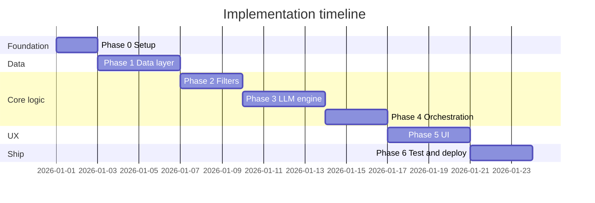

# Phase-Wise Implementation Plan

This plan implements the **AI-Powered Restaurant Recommendation System** defined in [context.md](./context.md) and [architecture.md](./architecture.md). Work proceeds in **seven phases** (Phase 0–6). Each phase has clear deliverables, tasks, exit criteria, and traceability to product success criteria.

---

## Plan Overview




| Phase | Name                            | Primary layer(s)  | Outcome                               |
| ----- | ------------------------------- | ----------------- | ------------------------------------- |
| **0** | Project foundation              | —                 | Repo, config, models, dev environment |
| **1** | Data ingestion & store          | Data              | Normalized catalog from Hugging Face  |
| **2** | Filter engine                   | Integration       | Deterministic `CandidateList`         |
| **3** | LLM recommendation engine       | Integration + LLM | Rank, explain, parse JSON             |
| **4** | Orchestration service           | Application       | End-to-end `recommend()`              |
| **5** | Presentation layer              | Presentation      | Zomato-style form + results           |
| **6** | Quality, hardening & deployment | Cross-cutting     | Tested, demo-ready MVP                |


**Recommended stack (MVP):** Python 3.11+, `datasets`, Pydantic, groq-compatible LLM client, Streamlit (single-process per architecture §10.1).

**Indicative duration:** ~3 weeks solo (adjust per team size). Phases are **sequential**; do not start LLM work (Phase 3) until filters (Phase 2) return realistic candidates.

---

## Traceability Matrix

Maps [context.md](./context.md) success criteria to phases:


| Success criterion                                              | Phase(s) |
| -------------------------------------------------------------- | -------- |
| Dataset loads and preprocesses from Hugging Face               | 0, 1     |
| User can specify location, budget, cuisine, min rating, extras | 5        |
| Filtering narrows candidates before LLM                        | 2, 4     |
| LLM ranks and provides per-restaurant explanations             | 3, 4     |
| UI shows name, cuisine, rating, cost, explanation              | 5        |


---

## Phase 0: Project Foundation

**Goal:** Establish repository structure, configuration, domain models, and tooling so later phases plug into stable contracts.

**Architecture refs:** §4 Domain Model, §6 Component Map, §9.1 Configuration

### Tasks


| #   | Task                  | Details                                                                                                                           |
| --- | --------------------- | --------------------------------------------------------------------------------------------------------------------------------- |
| 0.1 | Initialize repository | `app/` package layout per architecture §6; `requirements.txt` or `pyproject.toml`                                                 |
| 0.2 | Environment & secrets | `.env.example` with `HF_DATASET_ID`, `LLM_API_KEY`, `LLM_MODEL`; document local setup in README                                   |
| 0.3 | Configuration module  | `app/config.py`: `MAX_CANDIDATES` (20), `TOP_K` (5), `BUDGET_THRESHOLDS`, dataset ID                                              |
| 0.4 | Domain models         | `app/models.py`: Pydantic models for `Restaurant`, `UserPreferences`, `CandidateList`, `Recommendation`, `RecommendationResponse` |
| 0.5 | Logging baseline      | Structured logs for later observability (§9.2)                                                                                    |
| 0.6 | Dev scripts           | Optional: `make run`, `make test`; `.gitignore` for `.env`, `__pycache__`, `.cache`                                               |


### Suggested directory structure

```
projects/
├── app/
│   ├── __init__.py
│   ├── config.py
│   ├── models.py
│   ├── data/
│   ├── integration/
│   ├── llm/
│   ├── services/
│   └── ui/
├── tests/
├── .env.example
├── requirements.txt
└── README.md
```

### Deliverables

- Runnable empty app (imports succeed)
- All schema types defined and validated with sample JSON
- Config loads from environment with sensible defaults

### Exit criteria

- `python -c "from app.models import Restaurant, UserPreferences"` succeeds
- No secrets committed to git

### Dependencies

- None (first phase)

---

## Phase 1: Data Ingestion & Store

**Goal:** Load the Zomato dataset from Hugging Face, normalize into `Restaurant` records, and expose a cached in-memory store.

**Architecture refs:** §3.4 Data layer, context §“Data Ingestion”

**Context workflow step:** 1. Data Ingestion

### Tasks


| #   | Task                   | Details                                                                                  |
| --- | ---------------------- | ---------------------------------------------------------------------------------------- |
| 1.1 | Hugging Face loader    | `app/data/loader.py`: load `ManikaSaini/zomato-restaurant-recommendation` via `datasets` |
| 1.2 | Field mapping          | Map raw columns → `Restaurant` fields; inspect dataset schema on first run               |
| 1.3 | Normalization          | Trim names; extract canonical city and area/locality; split cuisine strings to `list[str]`      |
| 1.4 | Budget tier derivation | Map cost/price field → `low | medium | high` using `BUDGET_THRESHOLDS` from config       |
| 1.5 | Rating handling        | Coerce to float; policy for missing (exclude row or default—document choice)             |
| 1.6 | Stable IDs             | Generate `id` (hash of name+location or row index) for LLM join                          |
| 1.7 | Restaurant store       | `app/data/store.py`: load-once singleton; `get_all() -> list[Restaurant]`                |
| 1.8 | Startup hook           | Function `load_catalog()` called at app init; fail fast if HF unreachable                |
| 1.9 | Unit tests             | Tests for mapping, budget tiers, cuisine split, ID stability                             |


### Deliverables

- Catalog loads in < few seconds on dev machine
- Sample script or test printing 5 normalized restaurants
- Optional: export normalized data to `data/restaurants.parquet` for faster restarts

### Exit criteria

- **Success criterion:** Dataset loads and preprocesses correctly from Hugging Face
- Store returns non-empty list; spot-check names, locations, ratings match source
- Unit tests pass for ingestion edge cases

### Dependencies

- Phase 0 complete

### Risks & mitigations


| Risk                          | Mitigation                                   |
| ----------------------------- | -------------------------------------------- |
| Column names differ from docs | Log raw schema on first load; adjust mapper  |
| Large download                | Cache HF dataset locally; document `HF_HOME` |


---

## Phase 2: Filter Engine (Integration Layer — Deterministic)

**Goal:** Implement hard filters and candidate capping to produce `CandidateList` without calling the LLM.

**Architecture refs:** §3.5.1 Filter engine, hybrid principle §1

**Context workflow step:** 3. Integration Layer (filter portion)

### Tasks


| #   | Task                  | Details                                                                              |
| --- | --------------------- | ------------------------------------------------------------------------------------ |
| 2.1 | Filter module         | `app/integration/filters.py`: `apply_filters(catalog, preferences) -> CandidateList` |
| 2.2 | Location filter       | Normalize and match city first, then optionally filter by selected area/locality       |
| 2.3 | Cuisine filter        | Skip if user cuisine empty; else case-insensitive match in `restaurant.cuisine`      |
| 2.4 | Minimum rating filter | `rating >= minRating` (default 0)                                                    |
| 2.5 | Budget filter         | `restaurant.budgetTier == preferences.budget`                                        |
| 2.6 | Candidate cap         | Sort by rating desc; take top `MAX_CANDIDATES`                                       |
| 2.7 | Metadata              | Populate `appliedFilters`, `totalBeforeFilter`, `totalAfterFilter`                   |
| 2.8 | CLI / script probe    | Temporary script: stdin preferences → print candidate count and sample rows          |
| 2.9 | Unit tests            | Empty result, single filter, combined filters, cap behavior                          |


### Deliverables

- `CandidateList` for sample cities (Delhi, Bangalore) with varied preferences
- Documented filter order: location → cuisine → min rating → budget → cap

### Exit criteria

- **Success criterion (partial):** Filtering narrows candidates before LLM (logic verified without LLM)
- Zero-match case returns empty `candidates` with correct counts
- Filter tests green

### Dependencies

- Phase 1 complete (catalog in store)

### Optional (defer to Phase 3/4)

- Keyword scan for `additionalPreferences` on name/cuisine—or leave soft matching to LLM only (architecture §3.5.1)

---

## Phase 3: LLM Recommendation Engine

**Goal:** Build prompt assembly, LLM client, response parsing, and fallbacks so the system ranks and explains only from the candidate list.

**Architecture refs:** §3.5.2 Prompt builder, §3.5.3 Response parser, §3.6 Recommendation engine, §5 LLM Contract

**Context workflow step:** 4. Recommendation Engine

### Tasks


| #   | Task                    | Details                                                                                         |
| --- | ----------------------- | ----------------------------------------------------------------------------------------------- |
| 3.1 | LLM client abstraction  | `app/llm/client.py`: `complete(messages, **options) -> str`; env-based provider                 |
| 3.2 | Prompt builder          | `app/integration/prompts.py`: system + user blocks; inject preferences + compact candidate JSON |
| 3.3 | JSON schema in prompt   | Embed expected response shape (§5.1); instruct “only IDs from list”                             |
| 3.4 | Inference settings      | Temperature 0.2–0.4; max tokens ~800–1500; JSON mode if available                               |
| 3.5 | Response parser         | `app/integration/parser.py`: extract JSON, validate IDs, ranks, no duplicates                   |
| 3.6 | Retry on malformed JSON | One retry with “fix JSON only”                                                                  |
| 3.7 | Fallback path           | On failure: top `TOP_K` by rating + template explanations                                       |
| 3.8 | Integration test        | Mock LLM returning valid JSON → parsed `LLMRankingResult`                                       |
| 3.9 | Manual smoke test       | Real API call with 5–10 hardcoded candidates (cost control)                                     |


### Deliverables

- Prompt template file or function with clear placeholders
- Parser handles valid JSON, unknown IDs, partial arrays
- Logged latency and raw response on debug level

### Exit criteria

- **Success criterion:** LLM ranks options and provides per-restaurant explanations (verified via mock + one live call)
- No hallucinated `restaurantId` in successful path
- Fallback triggers when parser fails twice

### Dependencies

- Phase 2 complete (realistic `CandidateList` for prompt testing)
- Valid `LLM_API_KEY`

### Risks & mitigations


| Risk              | Mitigation                                       |
| ----------------- | ------------------------------------------------ |
| Token overflow    | Enforce `MAX_CANDIDATES`; compact candidate JSON |
| Non-JSON response | Parser + retry + fallback                        |
| API cost          | Use smaller model for dev; mock in CI            |


---

## Phase 4: Orchestration Service

**Goal:** Wire data, filters, and LLM into a single `recommend(preferences)` operation with validation and merge logic.

**Architecture refs:** §3.3 Application / orchestration, §2.2 Request lifecycle

### Tasks


| #   | Task                  | Details                                                                                  |
| --- | --------------------- | ---------------------------------------------------------------------------------------- |
| 4.1 | Recommender service   | `app/services/recommender.py`: `recommend(prefs) -> RecommendationResponse`              |
| 4.2 | Preference validation | Required location & budget; clamp `minRating`; cap `additionalPreferences` length        |
| 4.3 | Orchestration flow    | Validate → load catalog → filter → empty handling → LLM → merge                          |
| 4.4 | Empty result handling | User guidance message when `candidates` empty (broaden filters)                          |
| 4.5 | Merge step            | Join LLM ranks with `Restaurant` by `id`; attach dataset fields to each `Recommendation` |
| 4.6 | Response metadata     | `meta.candidatesConsidered`, `meta.filtersApplied`                                       |
| 4.7 | Integration tests     | Mock LLM; full path from preferences to `RecommendationResponse`                         |
| 4.8 | Optional REST API     | `app/api/routes.py`: `POST /api/v1/recommendations` (FastAPI)—skip if Streamlit-only MVP |


### Deliverables

- Callable `recommend()` usable from CLI, tests, and UI
- Integration test suite for happy path, empty filter, LLM fallback

### Exit criteria

- End-to-end backend path works without UI
- **Success criteria:** Filtering before LLM + LLM rank/explain enforced in one service
- Merged response includes only dataset facts for name, cuisine, rating, cost

### Dependencies

- Phases 1, 2, 3 complete

---

## Phase 5: Presentation Layer (UI)

**Goal:** Zomato-style UX—preference form, loading states, result cards with all required fields, optional summary.

**Architecture refs:** §3.2 Presentation layer, context §“Output Display”

**Context workflow steps:** 2. User Input, 5. Output Display

### Tasks


| #   | Task                | Details                                                                                                             |
| --- | ------------------- | ------------------------------------------------------------------------------------------------------------------- |
| 5.1 | Choose UI framework | Streamlit recommended for MVP (architecture §10.1)                                                                  |
| 5.2 | App entry           | `app/ui/app.py` or `streamlit_app.py`; call `load_catalog()` on startup                                             |
| 5.3 | Preference form     | City dropdown from dataset cities plus optional area/locality dropdown for selected city, budget select, cuisine, min rating slider, additional prefs text |
| 5.4 | Submit handler      | Invoke `recommend()`; show spinner during LLM call                                                                  |
| 5.5 | Results cards       | Name, cuisine, rating, estimated cost, rank, AI explanation                                                         |
| 5.6 | Summary block       | Display LLM `summary` when present                                                                                  |
| 5.7 | Empty state         | Message when no matches + suggestions                                                                               |
| 5.8 | Error state         | LLM failure message; note if fallback used                                                                          |
| 5.9 | Manual E2E          | Walk through Delhi + Italian + medium + 4.0 rating scenario                                                         |


### Deliverables

- Runnable UI: `streamlit run app/ui/app.py` (or documented command)
- Screenshots or short demo script for README

### Exit criteria

- **Success criterion:** User can specify all preference types via UI
- **Success criterion:** UI shows name, cuisine, rating, cost, explanation clearly
- All context.md output fields visible on each card

### Dependencies

- Phase 4 complete

### UX checklist

- City and area/locality options populated from dataset (avoid free-text mismatch)
- Results scannable (rating prominent, explanation below fold OK)
- Loading indicator during LLM (dominant latency per §9.4)

---

## Phase 6: Quality, Hardening & Deployment

**Goal:** Test coverage, reliability behaviors, documentation, and demo-ready deployment.

**Architecture refs:** §9 Cross-cutting, §10 Deployment, §11 Testing Strategy

### Tasks


| #   | Task                         | Details                                                                       |
| --- | ---------------------------- | ----------------------------------------------------------------------------- |
| 6.1 | Unit test coverage           | Ingestion, filters, parser, validation (target critical paths)                |
| 6.2 | Integration tests            | Orchestrator with mocked LLM in CI                                            |
| 6.3 | E2E checklist                | Manual script covering 3 preference scenarios + empty + LLM failure           |
| 6.4 | Reliability pass             | Verify behaviors in §9.5: dataset fail, zero match, LLM timeout, partial JSON |
| 6.5 | Security pass                | API keys server-side only; sanitize preference string length                  |
| 6.6 | Observability                | Log candidate count, LLM latency, parse success per request                   |
| 6.7 | README                       | Setup, env vars, run instructions, architecture link                          |
| 6.8 | Deployment                   | Local Docker optional; or documented `streamlit run` for demo                 |
| 6.9 | Final success criteria audit | Walk context.md checklist; mark complete                                      |


### Deliverables

- `tests/` green in CI or local `pytest`
- README with setup and demo steps
- Optional `Dockerfile` for reproducible demo

### Exit criteria

- All [context.md](./context.md) success criteria checked off
- Demo completes in < 2 minutes including one live LLM call
- Known limitations documented (no auth, single-process, etc.)

### Dependencies

- Phase 5 complete

---

## Phase Summary Checklist

Use this as a master progress tracker:


| Phase             | Status | Key deliverable          |
| ----------------- | ------ | ------------------------ |
| 0 – Foundation    | ⬜      | Models + config          |
| 1 – Data          | ⬜      | HF catalog in store      |
| 2 – Filters       | ⬜      | `CandidateList`          |
| 3 – LLM           | ⬜      | Prompt + parser + client |
| 4 – Orchestration | ⬜      | `recommend()`            |
| 5 – UI            | ⬜      | Streamlit app            |
| 6 – Ship          | ⬜      | Tests + README + demo    |


---

## Per-Phase Testing Expectations

Aligned with [architecture.md](./architecture.md) §11:


| Phase | Minimum tests before proceeding                     |
| ----- | --------------------------------------------------- |
| 0     | Model validation unit tests                         |
| 1     | Ingestion / normalization unit tests                |
| 2     | Filter unit tests (incl. edge cases)                |
| 3     | Parser unit tests + one mocked LLM integration test |
| 4     | Full orchestration integration test (mocked LLM)    |
| 5     | Manual E2E on UI                                    |
| 6     | Full suite + reliability scenarios                  |


---

## Optional Post-MVP Extensions

Not required for initial delivery; schedule after Phase 6 if needed:


| Extension                        | Architecture ref      |
| -------------------------------- | --------------------- |
| FastAPI + React split            | §10.2 Production-lite |
| Parquet cache for faster startup | §3.4 Storage options  |
| REST API only (headless)         | §7 API Design         |
| Vector search / geo radius       | §13 Future extensions |
| Prompt A/B testing               | §13                   |


---

## Suggested Weekly Schedule (Solo Developer)


| Week       | Phases    | Focus                                                 |
| ---------- | --------- | ----------------------------------------------------- |
| **Week 1** | 0 → 1 → 2 | Foundation, data pipeline, filters working in scripts |
| **Week 2** | 3 → 4     | LLM integration, orchestration, backend E2E           |
| **Week 3** | 5 → 6     | UI polish, tests, README, demo                        |


---

## Document Map


| Document                                       | Role                               |
| ---------------------------------------------- | ---------------------------------- |
| [problemstatement.txt](./problemstatement.txt) | Original requirements              |
| [context.md](./context.md)                     | Product context & success criteria |
| [architecture.md](./architecture.md)           | Technical design & contracts       |
| **implementation-plan.md** (this file)         | Phased build order & tasks         |


---

*Execute phases in order. Do not skip Phase 2 before Phase 3—the hybrid architecture depends on deterministic filtering to bound LLM input and prevent hallucinated venues.*